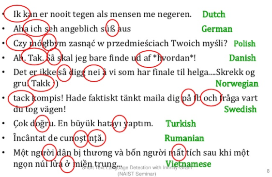

# Grundlagen

**Inhaltsverzeichnis**

- [Spracherkennung](#Spracherkennung)  
  - [Einleitung](#Einleitung)
  - [Trefferquote](#Trefferquote)
  - [Zeichensatz](#Zeichensatz)
  - [Herausforderungen](#Herausforderungen)
- [Lösungsansätze](#Lösungsansätze)
  - [Wörterbuch](#Wörterbuch)
  - [Klassifikation mit Supervised Learning](#Klassifikation-mit-Supervised-Learning)
  - [Deep Learning](#Deep-Learning)
 
[Zurück zum Hauptmenu](../README.md)

## Spracherkennung

### Einleitung
Für Aufgaben wie die Suche im Internet, Indexierung und Auswertung von Dokumenten, Erkennung von Spam Email, Beantwortung von 
Fragen, Verwendung von Chatbots u.v.m. werden sprachabhängige NLP (natural language processing) Modelle eingesetzt. 

Die Basis für den Einsatz solch spezifischer Modelle bildet die korrekte Erkennung der Sprache anhand von Zeichen, Wörtern und Sätzen. 
Dies bezeichnet man als Spracherkennung oder im englischen Language Detection/Identification. Ziel ist die Erreichung einer hohen
Trefferquote. Diese hängt von mehreren Faktoren ab, wie zum Beispiel:
- Länge des Textes
- Art der Wörter und Texte
- Sprachen die unterschieden werden sollen

### Trefferquote
Je höher die Trefferquote umso besser. Bei 90% hat man immer noch 100 Fehler auf 1'000 Datensätze, daher ist dass in den 
meisten Fällen nicht ausreichend. Eine Trefferquote von 98% und mehr ist daher wünschenswert respektive für viele 
Anwendungen sehr wichtig.

### Zeichensatz
Je nach Anwendungsfall muss das System auch in der Lage sein, den Zeichensatz zu erkennen, damit die Daten richtig 
interpretiert werden. Bei der Auswertung von Dokumenten kann dies zum Beispiel in den Metadaten detektiert werden oder
bei Web Services via HTTP Header Informationen. 

In vielen Anwendungsfällen ist der Zeichensatz der Anwendung aber bekannt, so dass dieses Problem wegfällt. 

### Herausforderungen
**Ist die Sprachidentifikation von Texten noch ein ungelöstes Problem oder sind die existierenden Lösungen ausreichend?** 

Bei regulären Texten mit genügend Worten ist mit den heutigen Modellen eine Voraussage mit hoher Präzision sehr gut 
möglich. Schwieriger wird es bei Spezialfällen wie zum Beispiel:
- Kurze Texte (wie Twitter Tweets).
- Akronyme, seltene Worte oder Abkürzungen (wie LOL für laughing out loud).
- Texte welche die Rechtschreiberegeln/Orthographie verletzen.
- Mehrsprachige Dokumente.
- Unterscheidung von nah verwandten Sprachen (wie Dänisch und Norwegisch).  

Die durchgeführten [Modell](Modelle.md) und [Performance](Performance.md) Tests zeigen bei der allgemeinen Trefferquote 
gute bis ausgezeichnete Resultate. Die Untersuchung der Trefferquote je Anzahl Wörter (also dem Spezialfall mit wenig 
Text) fallen die Resultate hingegen sehr unterschiedlich aus! 

## Lösungsansätze
Für die Identifikation der Sprache eines Textes gibt es unterschiedliche Lösungsansätze. Eine einfache Variante ist
der Einsatz eines Wörterbuchs je Sprache. Andere Ansätze basieren auf der Klassifikation  von Texten mittels Supervised 
Learning Algorithmen oder dem Einsatz von neuronalen Netzwerken. 

### Wörterbuch
Bei diesem Ansatz wird die Häufigkeit von Wortformen im Textkorpus untersucht. Das Lexikon enthält dabei Wörter und Wortformen die
sehr häufig in einer Sprache auftreten oder sehr typisch für eine spezifische Sprache sind.

#### Sprachspezifische Hinweise
Die folgenden Beispiele zeigen einige sprachspezifische Hinweise, welche mit dem Wörterbuch Ansatz eingesetzt werden können:
 
Quelle: [Short Text Language Detection with Infinity-Gram](https://de.slideshare.net/shuyo/short-text-language-detection-with-infinitygram-12949447)

#### Eigenschaften
- Der Ansatz mit den Wörterbüchern ist einfach und schnell. 
- Er ist ausgerichtet auf Texte welche schon während der Modellerstellung vorhanden sind und mit Tests überprüft werden können. 
- Bei Texten mit seltenem Vokabular sinkt die Erkennungsrate.
- Je nach Einsatzzweck kann das Wörterbuch mit spezifischen Ausdrücken ergänzt werden um die Trefferquote zu steigern. 
  Das heisst in solchen Fällen steigt die Grösse der Wörterbücher je Sprache an. 

Quelle: [Wortbasierte Ansätze](https://www.cis.uni-muenchen.de/~stef/veroeffentlichungen/grenzen_der_sprachenidentifizierung.pdf)

#### Praxisbeispiel
Die Mobiliar **LangFromStopwords** Bibliothek basiert auf diesem Ansatz. Die durchgeführten [Modell](Modelle.md) und 
[Performance](Performance.md) Tests bestätigen die erwähnten Eigenschaften sehr gut.

### Klassifikation mit Supervised Learning
Bei diesen Ansatz wird der zu untersuchende Text in Token (Fragmente) zerlegt. Diese dienen als Feature für das Modell, 
welches die Klassifikation vornimmt. Als Modell kann beispielswiese der Naïve Bayes Algorithmus verwendet werden.   

#### Feature
Mit der N-Gramm Technik werden Texte in Fragmente zerlegt. Jeweils N aufeinanderfolgende Fragmente werden als N-Gramm 
zusammengefasst. Als Fragmente können Buchstaben, Phoneme, Wörter, Wendungen oder Ähnliches verwendet werden.

Für die Spracherkennung kommen oft **Trigramme** zur Anwendung:
 
Quelle: [Short Text Language Detection with Infinity-Gram](https://de.slideshare.net/shuyo/short-text-language-detection-with-infinitygram-12949447)

Die so erstellten Fragmente werden nun als Features für die Klassifikation verwendet. 

#### Naïve Bayes
Die Naïve Bayes Algorithmen  basieren auf dem [Bayes' Theorem](https://de.wikipedia.org/wiki/Satz_von_Bayes). Eine Klassifikation  
ist dabei nichts anderes als die bedingte Wahrscheinlichkeit, ob ein Sample zu einer bestimmten Klasse gehört. Das 
trainierte Modell kennt also die Wahrscheinlichkeiten der N-Gramme in Bezug auf deren Klassifikation. 
Die Spracherkennung von neuen Texten erfolgt nun durch Aufsummierung der einzelnen Wahrscheinlichkeiten. Für normale 
Texte welche gross genug sind wird eine gute Trefferquote erreicht. Probleme kann es kurzen Texten oder bei der 
Unterscheidung von verwandten Sprachen mit identischen oder ähnlichen N-Grammen kommen. 

#### Eigenschaften Naïve Bayes
- Sehr gute Performance bei vielen Features.
- Algorithmus ist robust, da nicht relevante Features kaum ins Gewicht fallen.
- Ist ein sehr guter «Basis» Algorithmus der ansprechende Resultate liefert. 
- Je nach Anwendung, findet man in der Praxis oft einen spezifischeren Algorithmus der präzisiere Resultate liefert.
- Bei Texten mit seltenem Vokabular sinkt die Erkennungsrate, ist im allgemeinen jedoch besser als beim Ansatz mit
dem Wörterbuch.
- •	Nachträgliche  Anpassungen vom Modell mit neuem Vokabular bedingt ein neues Modelltraining und ist aufwändiger als
beim Wörterbuch.

#### Praxisbeispiel 
Sowohl die **LangDetect** als auch **LangDetectSpacy** Bibliotheken basieren auf diesesm Ansatz. Die durchgeführten 
[Modell](Modelle.md) Tests zeigen bessere Resultate gegenüber dem Wörterbuch basierten Ansatz der LangFromStopwords 
Bibliothek. Dafür ist diese bei den [Performance](Performance.md) Messungen im Vorteil. 

### Deep Learning
Bei [Deep Learning](https://de.wikipedia.org/wiki/Deep_Learning) kommen künstliche neuronale Netzwerke zum Einsatz. 
Als Vorbild dienen hier biologische neuronale Netzwerke aus der Natur, im Gegensatz zu Algorithmen (wie Entscheidungsbäumen 
oder Modellen zur Klassifizierung) welche auf statistischen oder mathematischen Grundlagen basieren.  

Ein neuronales Netzwerk besteht aus einem Input, einem Output und einem oder mehreren Hidden Layern: 

Quelle: [Data Science Fundamentals](https://towardsdatascience.com/machine-learning-fundamentals-ii-neural-networks-f1e7b2cb3eef)

Die Informationen werden als Feature dem Input Layer übergeben. Anschliessend werden die Informationen von Layer zu 
Layer weiterverarbeitet. Die Erkenntnisse des einen Layer dienen als Input für den nächsten Layer. Damit lassen sich gut 
sequentielle Daten (wie Ton, Bilder oder Texte) verarbeiten.

Bei einer reinen sequentiellen Verarbeitung von links nach rechts hat man den Nachteil, dass der Text nur durch bereits
verarbeitete Daten interpretiert wird. Für fortgeschrittene NLP Aufgaben sind aber auch Informationen wichtig, die noch
nicht verarbeitet wurden. Zu diesem Zweck gibt es auch bidirektionale Netzwerke, wo die Ausgaben eines Layer als 
Eingabe für vorherige Layer zurückfliessen. 

#### Praxisbeispiel
Die **LangFromChars** Bibliothek der Mobiliar basiert auf einen solchen Ansatz. Konkret kommt ein `bidirectional gated 
recurrent unit` (BiBRU) zum Einsatz. Die durchgeführten [Modell](Modelle.md) und [Performance](Performance.md) Tests 
zeigen aber (zumindest für die verwendeten Testdaten) schlechtere Ergebnisse gegenüber den anderen Bibliotheken.

Im Gegensatz zu den **Azure Congnitive Services** welche ebenfalls auf **neuronalen Netzwerk Technologien** 
basieren und bei den Tests sehr gute Trefferquoten erreicht haben. Besonders bei wenig  Text (Worten) ist der Service
den anderen Bibliotheken weit überlegen. 

---
[Zum Seitenanfang](#Grundlagen)  &nbsp; | &nbsp;  [Zum Hauptmenu](../README.md)
