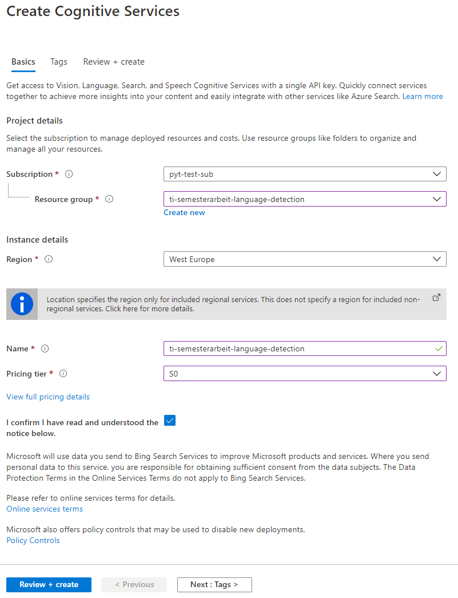
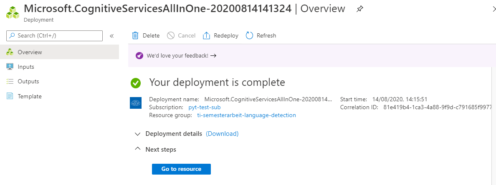
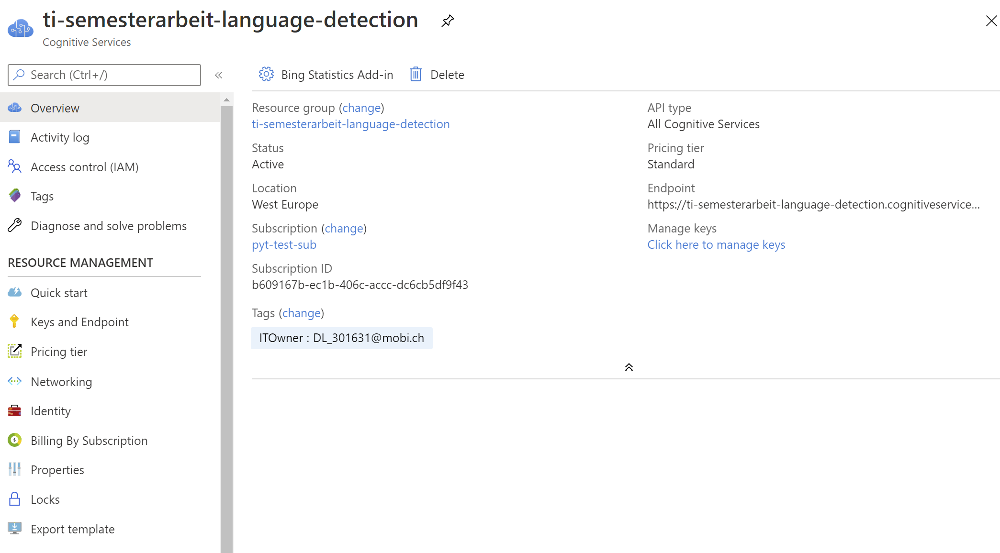
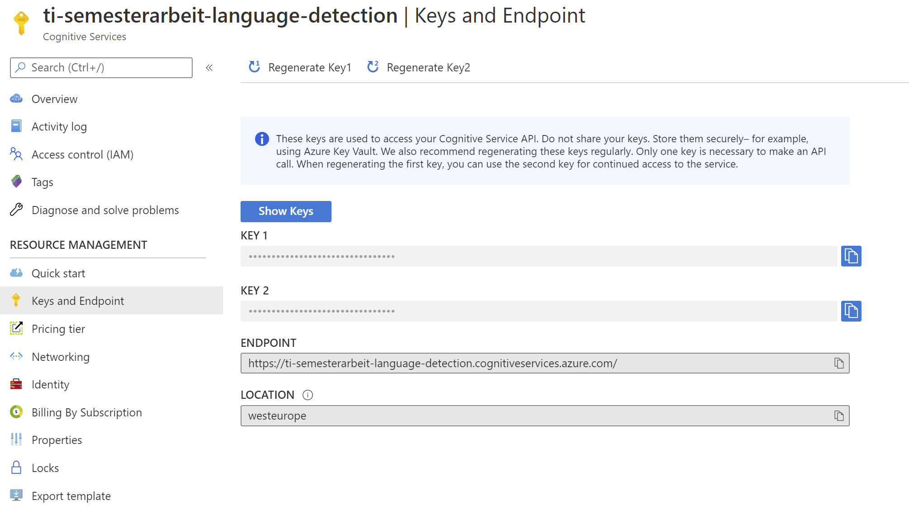

# Installation

**Inhaltsverzeichnis**
- [Übersicht](#Übersicht)
  - [Conda Environment](#Conda-Environment)
  - [Einschränkungen](#Einschränkungen)
  - [Erweiterungen](#Erweiterungen)
- [Mobiliar Libraries](#Mobiliar-Libraries)
  - [LangFromChars](#LangFromChars)
  - [LangFromStopwords](#LangFromStopwords)
- [Externe Libraries](#Externe-Libraries)
  - [LangDetect](#LangDetect)
  - [LangDetectSpacy](#LangDetectSpacy)
  - [TextBlob](#TextBlob)
- [Cloud Services](#Cloud-Services)
  - [Azure Text Analytics](#Azure-Text-Analytics)
- [System Monitoring](#System-Monitoring)
  - [psutil](#pstuil)
  - [resource](#resource)
  
[Zurück zum Hauptmenu](../README.md)

## Übersicht

### Conda Environment

Die notwendige Python Umgebung kann mit dem **Conda Package Manager** installiert werden. Dazu wurde eine YAML Datei
erstellt, die alle notwendigen Abhängigkeiten (Conda und PIP) enthält.

Erstellung env.yml 
- Für das Projekt wurde die Conda Umgebung `python-language-detection` erstellt. 
- Alle dort installierten Bibliotheken wurden nun wie folgt in die Datei `env.yml` exportiert: 
```shell script
conda env list
conda activate python-language-detection
conda env export > env.yml
``` 
> Dieser Schritt muss nicht mehr ausgeführt werden. Die Datei `env.yml` befindet sich im Hauptverzeichnis des Projekts.

Erstellung Conda Umgebung:
- Die Erstellung einer neuen Conda Umgebung kann nun mit der erstellen Datei erfolgen.
- Der folgende Befehl kann in der Anaconda Shell ausgeführt werden:
```shell script 
conda env create -f env.yml
conda activate python-language-detection
``` 
> Nun sind die notwendigen Bibliotheken installiert und die Umgebung für das Projekt aktiviert. Die nachfolgenden 
Kapitel erläutern weitere Details zu den einzelnen Bibliotheken. Für die LangDetectSpacy Bibliothek müssen noch die
entsprechenden Sprachmodelle installiert werden. Details hierzu siehe im Kapitel [LangDetectSpacy](#LangDetectSpacy).

### Einschränkungen
Für das öffentliche Repository sind folgende Einschränkungen zu beachten:
- Die Mobiliar Bibliotheken sind nicht Bestandteil des öffentlichen Repository.
- Das gleiche gilt für den Azure Text Analytics Service. Dieser ist auch firmenspezifisch und daher in der öffentlichen
Variante nicht verfügbar. 
- Verfügt man über einen eigenen Azure Text Analytics Service kann dieser durch Angabe von zwei Umgebungsvariablen
einfach aktiviert werden. Details siehe Kapitel [Azure Text Analytics](#Azure-Text-Analytics). 

> Das Projekt ist aber auch ohne dieses Bibliotheken lauffähig, da die Tests und Reports per Default nur die
öffentlichen Bibliotheken verwenden. Die Umsetzung erfolgt mit Hilfe der Klasse `ModelFactory` deren `create()` Methode, 
die per Default nur die öffentlichen Modelle zurückgibt.

### Erweiterungen
Das Projekt kann auf einfache Art und Weise mit neuen zu testenden Bibliotheken erweitert werden. Dazu sind folgende
Schritte notwendig:
- Erstellung Subklasse von `AbstractLanguageDetectionModel` welche die neue Bibliothek kapselt.
- Einbindung in die Methode `create()` der `ModelFactory` Klasse.

Damit berücksichtigen sämtliche Reports und Auswertungen automatisch die neuen Bibliotheken. 
Weitere Details siehe im Kapitel [Modelle](Modelle.md).

## Mobiliar Libraries
Die Mobiliar Libraries sind nicht in öffentlichen Repositories verfügbar. Eine Installation ist nur via internes Mobliliar
Repository möglich. Aus diesem Grund wird der Source Code der Modelle und alle benötigten Abhängigkeiten direkt in das 
vorliegende Projekt integriert. 

Die beiden Modelle verwenden eine Mobiliar interne Logging Komponente, welche auf die Microservice Infrastruktur abgestimmt ist. 
Diese Klasse wird mit einer neu erstellten `ConsoleLogger` Implementation ersetzt welche das gleiche Interface bereitstellt. 
Damit kann in den Modell Klassen einzig die Implementation (beim Import) ausgetauscht werden ohne das jedes einzelnen Logging 
Statement modifiziert werden muss. 

### LangFromChars
Das Modell wird wie folgt integriert:
1. Kopieren des original Source Code ins Verzeichnis **libs/langfromchars/mobi**.
2. Integration der Klasse **Vocabulary** ins gleiche Verzeichnis wie beim ersten Schritt.
3. Erstellung **ConsoleLogger** Implementation mit den gleichen Methoden wie die original MobiliarLogger Klasse.
4. Anpassung des **Import Statment** bei Line #15 der LangFromChars Klasse:
   ```python
   from ConsoleLogger import Logger
   ```
5. Installation der folgenden benötigten externen Libraries:
   ```shell script
   conda install dill
   conda install tqdm
   pip install tensorflow
   ```
6. Erstellung der **LangFromCharsDemo** Klasse um das Modell zu erkunden.


### LangFromStopwords
Das Modell wird wie folgt integriert:
1. Kopieren des original Source Code ins Verzeichnis **libs/langfromstopwords/mobi**.
2. Erstellung **ConsoleLogger** Implementation mit den gleichen Methoden wie die original Mobiliar Logger Klasse.
3. Anpassung des **Import Statement** bei Line #8 der LangFromStopwords Klasse:
   ```python
   from ConsoleLogger import Logger
   ```
4. Erstellung der **LangFromStopwordsDemo** Klasse um das Modell zu erkunden.
 

## Externe Libraries
The externen Libraries werden von den öffentlichen conada and pip Repository installiert. Die notwendigen Installationsschritte
und weitere Angaben zu den Modellen werden nachfolgend aufgeführt.

### LangDetect
Installation:
```shell script
pip install langdetect
```

### LangDetectSpacy
Installation:
```shell script
pip install spacy
pip install spacy-langdetect 
```

Falls die Installation der Modelle in einem Firmennetzwerk mit Firewall stattfindet, kann es zu einem SSLCertVerificationError kommen. 
In diesem Fall können die Modelle zuerst [heruntergeladen](https://github.com/explosion/spacy-models) und anschliessend mit pip 
installiert werden:
```shell script
pip install .\bin\spacy\en_core_web_sm-2.3.1.tar.gz
pip install .\bin\spacy\de_core_news_sm-2.3.0.tar.gz
pip install .\bin\spacy\it_core_news_sm-2.3.0.tar.gz
pip install .\bin\spacy\fr_core_news_sm-2.3.0.tar.gz
```
  
### TextBlob
Installation:
```shell script
pip install -U textblob
python -m textblob.download_corpora
```


## Cloud Services
Die Cloud Dienste werden entweder via REST API aufgerufen oder mittels Client Library, welche vom Provider zur Verfügung gestellt
wird und die REST Aufrufe kapselt. Die notwendigen Installations- und Konfigurationsschritte werden nachfolgend aufgeführt.

### Azure Text Analytics 
Der Azure Text Analytics Service ist Teil der Cognitive Services. Um diesen zu nutzen muss ein Azure Account erstellt werden. 
Anschliessend kann der Service provisioniert werden gemäss den folgenden Schritten:

1. [Azure Account erstellen](https://docs.microsoft.com/de-de/azure/cognitive-services/cognitive-services-apis-create-account?tabs=multiservice%2Cwindows)

2. [Cognitive Service Account erstellen](https://ms.portal.azure.com/#create/Microsoft.CognitiveServicesAllInOne)
   - Step 1/4<br />
     
   - Step 2/4<br />
     
   - Step 3/4<br />
     
   - Step 4/4<br />
     

3. Nun können die Werte für den Schlüssel (Key) und Url Endpoint abgelesen werden:  
   

4. Als nächstes werden auf dem Rechner auf dem das Projekt ausgeführt werden soll, die folgenden Umgebungsvariablen 
   mit den Werten vom Schritt 3 definiert:
   - AZURE_CS_KEY
   - AZURE_CS_ENDPOINT

5. Zur Überprüfung kann die Klasse `Environment` ausgeführt werden. Diese sollte nun den Service Endpoint auf der
   Konsole ausgeben. 


## System Monitoring
Für die Messung von CPU, Memory und Zeit wurden folgende Libraries untersucht. Im Verzeichnis `measure/system` sind 
Demo Scripts mit einigen Befehlen zum Erkunden der Bibliotheken aufgeführt. 

### pstuil
Installation:
```shell script
pip install psutil
```

### resource
Installation:
```shell script
pip install resource
```

---
[Zum Seitenanfang](#Installation)  &nbsp; | &nbsp;  [Zum Hauptmenu](../README.md)
