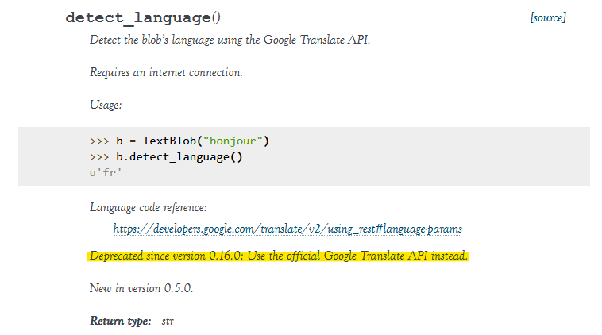
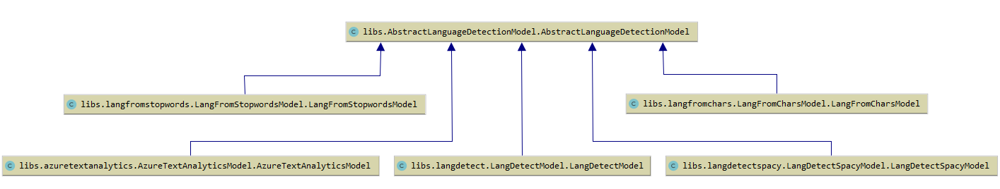
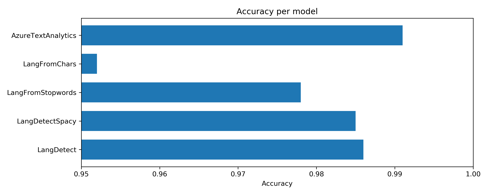
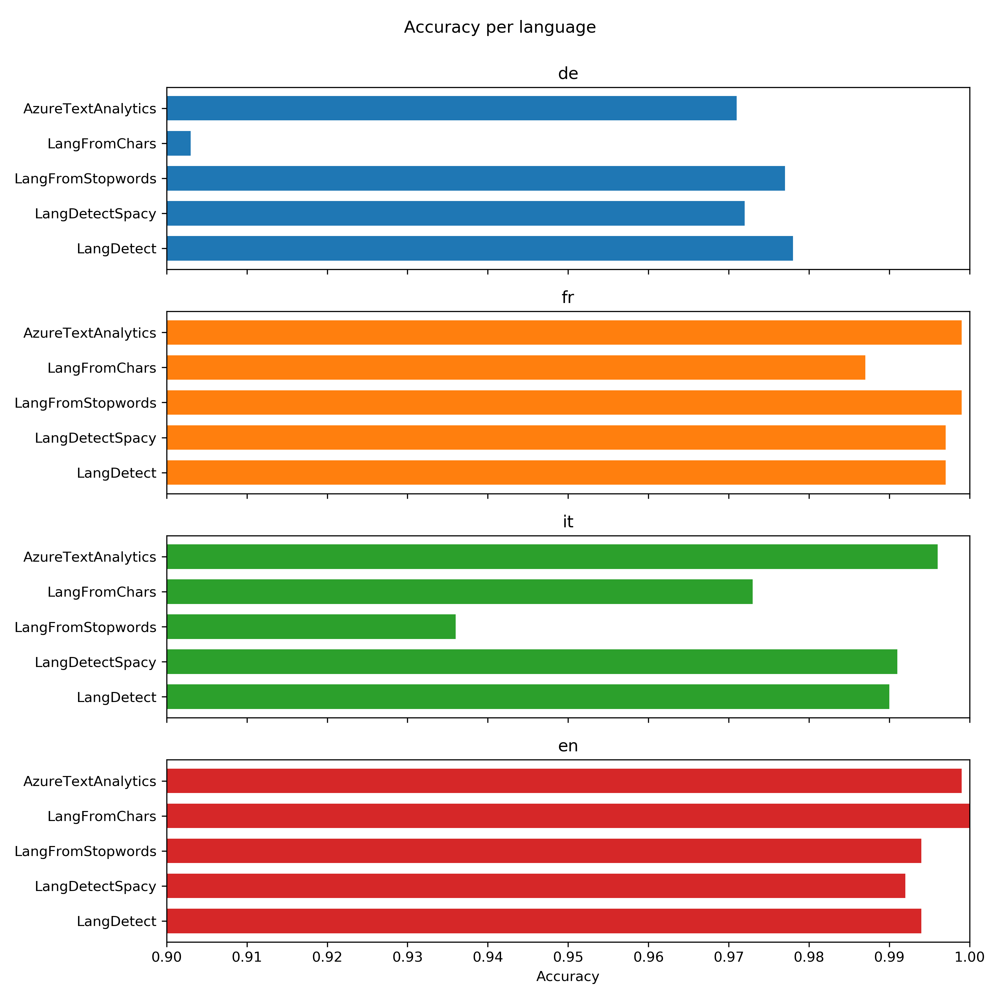
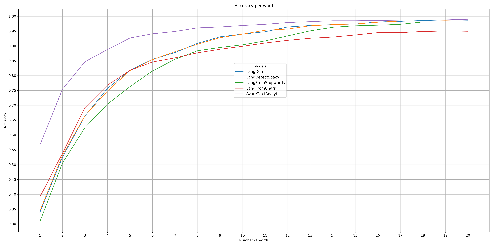
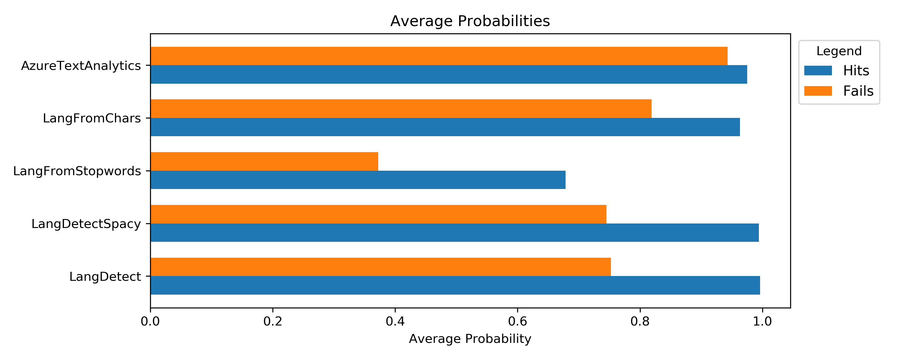
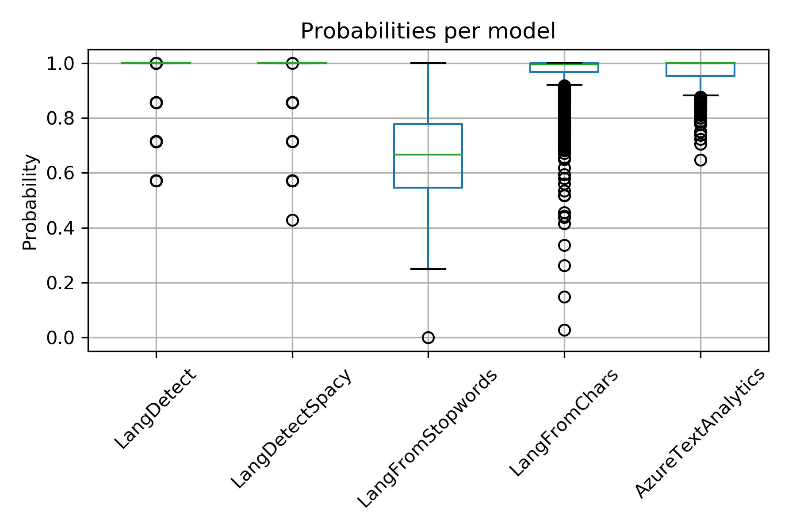
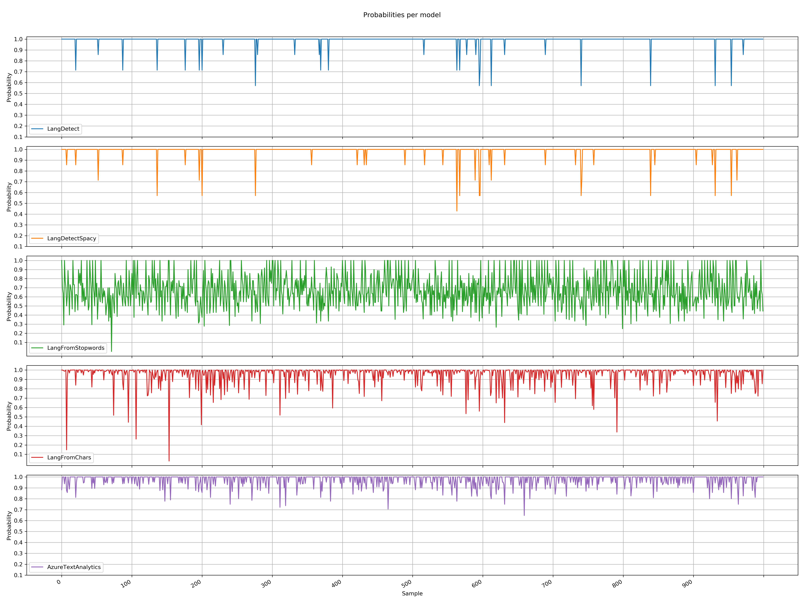

# Modelle

**Inhaltsverzeichnis**
- [Übersicht](#Übersicht)
- [Bibliotheken](#Bibliotheken)
  - [LangFromStopwords (Die Mobiliar)](#LangFromStopwords)
  - [LangFromChars (Die Mobiliar)](#LangFromChars)
  - [LangDetect](#LangDetect)
  - [LangDetectSpacy](#LangDetectSpacy)
  - [TextBlob](#TextBlob)
  - [Azure Text Analytics](#Azure-Text-Analytics)
- [Messungen](#Messungen)
  - [Aufbau](#Aufbau)
  - [Durchführung](#Durchführung)
- [Auswertungen](#Auswertungen)
  - [Accuracy](#Accuracy)
  - [Accuracy per language](#Accuracy-per-language)
  - [Accuracy per word](#Accuracy-per-word)
  - [Average probabilities](#Average-probabilities)
  - [Fazit](#Fazit)

[Zurück zum Hauptmenu](../README.md)


## Übersicht
Verglichen werden die Mobiliar interne Bibliotheken **LangFromStopwords** und **LangFormChars** mit den externen Bibliotheken 
**LangDetect** und **LangDetectSpacy** sowie dem Microsoft **Azure Text Analytics** Service. Nicht überprüft wird die **TextBlob**
Bibliothek, da diese deprecated ist.

Für die Messung der Modelle wurde ein einheitliche Schnittstelle eingeführt. Je Bibliothek finden verschiedene Messungen des Score 
und der Wahrscheinlichkeit statt. Anschliessend folgen die [Auswertungen](#Auswertungen) der Bibliotheken.

Details zu den Performance Messungen siehe [Performance](Performance.md). 


## Bibliotheken

### LangFromStopwords
Basierend auf einer Stopwortliste je Sprache wird anhand der gefunden Häufigkeit die Sprache ermittelt. Zusätzlich zum 
Sprachcode kann auch die Wahrscheinlichkeit ausgegeben werden. 

Der Ansatz mit der Stopwortliste funktioniert gut falls der Text genügend lang und die Frequenz der Stopwörter hoch 
genug ist. Bei spezifischen Andwendungsfällen können die Stopwortlisten entsprechend  angepasst/ergänzt werden. 

Die aktuellen Stopwortlisten sind im Projekt unter `libs/langfromstopwords/mobi/Data` abgelegt. Interessant ist die 
Anzahl Stopworte je Sprache. Wie die folgende Tabelle zeigt, sind diese sehr unterschiedlich:

Stopwort Datei           | Anzahl Einträge
------------------------ | ---------------  
english_stop_words.csv   | 571
french_stop_words.csv    | 496 
german_stop_words.csv    | 1940 
italian_stop_words.csv   | 273 

Lizenz: 
> Die Bibliothek ist eine Eigenentwicklung der Mobiliar und nicht frei verfügbar.

Das Script [LangFromStopwordsDemo.py](../libs/langfromstopwords/LangFromStopwordsDemo.py) zeigt die grundsätzliche 
Verwendung der Bibliothek:  
```python
from mobi.LangFromStopwords import LangFromStopwords
model = LangFromStopwords();

print("------------------------------------------------------------------------")
print("Start LangFromStopwordsDemo")
print("------------------------------------------------------------------------")

text = "Hello World, this is amazing"
pred = model.predict_single(text)
print(pred, ":", text)


texts = [
    "Hello World",
    "Hallo Welt",
    "Bon jour monde",
    "Guten Tag, how are you?",
    "Sarebbe troppo bello per essere vero",
    "LOL"
]
for text in texts:
    pred = model.predict_single(text, True)
    print(pred, ":", text)


pred = model.predict(texts, True)
print(pred)
```

Output:
```shell script
------------------------------------------------------------------------
Start LangFromStopwordsDemo
------------------------------------------------------------------------
en : Hello World, this is amazing
[('en', 1.0)] : Hello World
[('de', 1.0)] : Hallo Welt
[('fr', 1.0)] : Bon jour monde
[('de', 0.3333333333333333), ('en', 0.6666666666666666)] : Guten Tag, how are you?
[('it', 0.5), ('en', 0.25), ('de', 0.25)] : Sarebbe troppo bello per essere vero
[('fr', 0), ('it', 0), ('en', 0), ('de', 0)] : LOL
[[('en', 1.0)], [('de', 1.0)], [('fr', 1.0)], [('de', 0.3333333333333333), ('en', 0.6666666666666666)], [('it', 0.5), ('en', 0.25), ('de', 0.25)], [('fr', 0), ('it', 0), ('en', 0), ('de', 0)]]
```


### LangFromChars
Die Biblothek ist angelehnt and die [WhatTheLang](#https://github.com/indix/whatthelang) Library und adaptiert an die Mobiliar 
interne Laufzeitumgebung / Infrastruktur. Verwendet wird ein Zeichensequenz basiertes BiGRU (bidirectional gated recurrent unit) 
Modell, welches mit öffentlichen [TED](#https://www.ted.com) Daten trainiert wurde. Die Optimierung erfolgt mit einem ADAM Optimizer 
mit Nesterov Momentum. Der Loss ist Standard log-loss. Die Sprachen werden unabhängig von einander trainiert.

Implementierungsdetails:
- Für die Prognose werden die ersten 100 Character verwendet.
- Punkte, Zahlen und nicht druckbare Zeichen werden nicht berücksichtigt.
- Das Modell ist tolerant gegenüber Rechtschreibefehlern so dass für die Voraussage der Textsprache kein Preprocessing notwendig ist.

Lizenz: 
> Die Bibliothek ist eine Eigenentwicklung der Mobiliar und nicht frei verfügbar.

Das Script [LangFromCharsDemo.py](../libs/langfromchars/LangFromCharsDemo.py) zeigt die grundsätzliche Verwendung der 
Bibliothek:  
```python
```python
from mobi.LangFromChars import LangFromChars
model = LangFromChars();

print("------------------------------------------------------------------------")
print("Start LangFromCharsDemo")
print("------------------------------------------------------------------------")

text = "Hello World, this is amazing"
pred = model.predict(text)
print(pred, ":", text)


texts = [
    "Hello World, this is amazing",
    "Hallo Welt, heute ist ein schöner Tag",
    "Bon jour monde, aujourd'hui if fait la Grande Bleue",
    "Guten Tag, how are you?"
]
for text in texts:
    pred = model.predict_language_with_propa(text)
    print(pred, ":", text)
```

Output:
```shell script
------------------------------------------------------------------------
Start LangFromCharsDemo
------------------------------------------------------------------------
['en'] : Hello World, this is amazing
['en', 0.9973989933502992] : Hello World, this is amazing
['de', 0.999214697065101] : Hallo Welt, heute ist ein schöner Tag
['fr', 0.7392226471954076] : Bon jour monde, aujourd'hui if fait la Grande Bleue
['en', 0.9132539615553993] : Guten Tag, how are you?
```


### LangDetect
Die [Python LangDetect](https://pypi.org/project/langdetect) Bibliothek ist eine Portierung von Google's 
[Java Language Detection](https://code.google.com/archive/p/language-detection/) Implementation. Alle Klassen und 
Methoden wurden "eins zu eins" in den Python Code übernommen. 

Die Bibliothek unterstützt 55 Sprachen (out of the box) und kann mit weiteren Sprachen ergänzt werden. Für die 
Spracherkennung wird ein **Naive Bayse Algorithmus mit Character n-Gramm** verwendet. Das Training erfolgte mit
Wikipedia Artikeln in den entsprechenden Sprachen. Weitere Details sind in der folgenden 
[Präsentation](https://www.slideshare.net/shuyo/language-detection-library-for-java) ersichtlich.

Der Algorithmus ist nicht deterministisch, was bedeuted, dass man bei mehreren Aufrufen verschiedene Resultate erhalten 
kann. Das ist vor allem bei sehr kurzen oder mehrdeutigen Texten der Fall. Mit dem Befehl `DetectorFactory.seed = 0` 
kann man bei bedarf konsistente Resultate erzwingen. 

Lizenz: 
> Die Bibliothek ist unter der [Apache Software Lizenz](https://pypi.org/search/?c=License+%3A%3A+OSI+Approved+%3A%3A+Apache+Software+License)
verfügbar.
 

Das Script [LangDetectDemo.py](../libs/langdetect/LangDetectDemo.py) zeigt die grundsätzliche Verwendung der 
Bibliothek:  
```python
from langdetect import detect
from langdetect import detect_langs

print("------------------------------------------------------------------------")
print("Start LangDetectDemo")
print("------------------------------------------------------------------------")

text = "War doesn't show who's right, just who's left."
pred = detect(text)
print(pred, ":", text)

text = "Ein, zwei, drei, vier"
pred = detect(text)
print(pred, ":", text)

text = "Hello World, this is amazing"
pred = detect_langs(text)
print(pred, ":", text)

texts = [
    "Hello World, this is amazing",
    "Hallo Welt, heute ist ein schöner Tag",
    "Bon jour monde, aujourd'hui if fait la Grande Bleue",
    "Guten Tag, how are you?"
]
for text in texts:
    pred = detect_langs(text)
    print(pred, ":", text)
```

Output:
```shell script
------------------------------------------------------------------------
Start LangDetectDemo
------------------------------------------------------------------------
en : War doesn't show who's right, just who's left.
de : Ein, zwei, drei, vier
[en:0.9999989823110957] : Hello World, this is amazing
[en:0.9999970631666446] : Hello World, this is amazing
[de:0.9999975033056446] : Hallo Welt, heute ist ein schöner Tag
[fr:0.9999987379972479] : Bon jour monde, aujourd'hui if fait la Grande Bleue
[en:0.9999967365961222] : Guten Tag, how are you?
```


### LangDetectSpacy
Die [Spacy](https://spacy.io/) Bibliothek bietet viele Funktionen an, um Text für Deep Learning Lösungen vorzubereiten. 
Spacy interoperiert mit TenserFlow, PyTorch, scikit-learn und weitern Python Bibliotheken. Man kann auf einfache
Weise statistische Modelle für eine vielzahl von NLP (Natural language processing) Aufgaben nutzen und erstellen. 
Spacy untersützt über 59 Sprachen, die Version 2 bietet neuronale Modelle für `tagging, parsing and entity recognition` 
Aufgaben sowie vieles mehr an.

Lizenz: 
> Die Bibliothek ist unter einer [MIT Lizenz](https://github.com/explosion/spaCy/blob/master/LICENSE) verfügbar.

Das Script [LangDetectSpacyDemo.py](../libs/langdetectspacy/LangDetectSpacyDemo.py) zeigt die grundsätzliche Verwendung 
der Bibliothek:  
```python
import spacy
from spacy_langdetect import LanguageDetector

nlp = spacy.load("en_core_web_sm")

print("------------------------------------------------------------------------")
print("Start LangDetectSpacyDemo")
print("------------------------------------------------------------------------")

nlp.add_pipe(LanguageDetector(), name="language_detector", last=True)
text = "This is English text. Er lebt mit seinen Eltern und seiner Schwester in Berlin. Yo me divierto todos los días en el parque. Je m'appelle Angélica Summer, j'ai 12 ans et je suis canadienne."
doc = nlp(text)

# document level language detection. Think of it like average language of document!
print(doc._.language)

# sentence level language detection
for i, sent in enumerate(doc.sents):
    print(sent, sent._.language)

print("------------------------------------------------------------------------")

text = "War doesn't show who's right, just who's left."
doc = nlp(text)
pred = doc._.language
print(pred, ":", text)

text = "Ein, zwei, drei, vier"
doc = nlp(text)
pred = doc._.language
print(pred, ":", text)

text = "Hello World, this is amazing"
doc = nlp(text)
pred = doc._.language
print(pred, ":", text)

print("------------------------------------------------------------------------")


texts = [
    "Hello World, this is amazing",
    "Hallo Welt, heute ist ein schöner Tag",
    "Bon jour monde, aujourd'hui if fait la Grande Bleue",
    "Guten Tag, how are you?"
]

for text in texts:
    doc = nlp(text)
    pred = doc._.language
    print(pred, ":", text)
```

Output:
```shell script
------------------------------------------------------------------------
Start LangDetectSpacyDemo
------------------------------------------------------------------------
{'language': 'fr', 'score': 0.5714271373598774}
This is English text. {'language': 'en', 'score': 0.9999966886837335}
Er lebt mit seinen Eltern und seiner Schwester in Berlin. {'language': 'de', 'score': 0.9999968617468444}
Yo me divierto todos los días {'language': 'es', 'score': 0.9999943833489879}
en el parque. {'language': 'es', 'score': 0.9999945422370837}
Je m'appelle Angélica Summer, {'language': 'fr', 'score': 0.9999957021316248}
j'ai 12 ans et je suis canadienne. {'language': 'fr', 'score': 0.9999974342262357}
------------------------------------------------------------------------
{'language': 'en', 'score': 0.999997971166212} : War doesn't show who's right, just who's left.
{'language': 'de', 'score': 0.9999971814979507} : Ein, zwei, drei, vier
{'language': 'en', 'score': 0.9999946114547095} : Hello World, this is amazing
------------------------------------------------------------------------
{'language': 'en', 'score': 0.9999978075280812} : Hello World, this is amazing
{'language': 'de', 'score': 0.9999970176534019} : Hallo Welt, heute ist ein schöner Tag
{'language': 'fr', 'score': 0.9999968426445438} : Bon jour monde, aujourd'hui if fait la Grande Bleue
{'language': 'en', 'score': 0.8571407642803969} : Guten Tag, how are you?
```

  
### TextBlob
Die Spracherkennung der TextBlob Bibliothek verwendet das **Google Translate API** und benötigt  daher einen **Internet Zugang**. 
Innerhalb von Firmennetzen kann die Methode daher u.U. nicht genutzt werden, da die URL vom Proxy gesperrt wird.  

Das Script [TextBlobDemo.py](../libs/textblob/TextBlobDemo.py) zeigt die grundsätzliche Verwendung der Bibliothek:  
```python
from textblob import TextBlob

print("------------------------------------------------------------------------")
print("Start TextBlobDemo")
print("------------------------------------------------------------------------")

text = "War doesn't show who's right, just who's left."
blob = TextBlob(text)
pred = blob.detect_language()
print(pred, ":", text)
```

Output:
```shell script
------------------------------------------------------------------------
Start TextBlobDemo
------------------------------------------------------------------------
en : War doesn't show who's right, just who's left.
```

Eine Methode für die Angabe der Wahrscheinlichkeit fehlt. Entsprechend wurde das `AbstractLanguageDetectionModel` mit 
der Methode `predict_probability_is_supported()` ergänzt, damit bei den Tests geprüft werden kann, ob das aktuelle 
Modell diese Funktion unterstützt.  


**Deprecated**
- Für die Spracherkennung wird die Methode **detect_language()** verwendet, welche die Sprache zurückgibt. 
- Seit der Version 0.16.0 ist die Methode detect_language() **_deprecated_** und sollte nicht mehr benutzt werden. 
- Es wird empfohlen stattdessen die offizielle Googel Translate API zu verwenden. 
- Details siehe im folgenden Ausgzug der TextBlob API:<br /> 
      

**Too Many Requests Error**<br />
Bei der Verwendung des TextBlob Modells mit vielen Daten kommt es zu folgendem Fehler:
```shell script
raise HTTPError(req.full_url, code, msg, hdrs, fp)
urllib.error.HTTPError: HTTP Error 429: Too Many Requests
```

Da die Library einen Google Online Dienst verwendet, sieht es so aus, dass die erlaubte Quote überschritten ist. 
> Da die Funktion zur Spracherkennung **_deprecated_** ist und umfangreiche Messungen
> nicht möglich sind, wird auf eine weitere Untersuchung der Biblothek verzichtet.  


### Azure Text Analytics

Unter [Azure Text Analytics](https://docs.microsoft.com/de-de/azure/cognitive-services/text-analytics/overview) bietet
Microsoft einen cloudbasierten Dienst für die erweiterte Verarbeitung natürlicher Sprache anhand von unformatiertem 
Text an. Es werden folgenden Hauptfunktionen zur Verfügung gestellt:
- Standpunktanalyse
- Schlüsselbegriffserkennung
- Sprachenerkennung 
- Erkennung benannter Entitäten

Die API ist ein Teil von Azure Cognitive Services, einer Sammlung von Algorithmen für maschinelles Lernen und künstliche 
Intelligenz (KI) in der Cloud. Die Modelle und Dienste werden auch in den Microsoft eigenen Produkten eingesetzt.
Die Cloud Dienste werden entweder via REST API aufgerufen oder mittels Client Library, welche vom Provider zur Verfügung 
gestellt wird und die REST Aufrufe kappselt. 

Lizenz: 
> Der Service ist ein kommerzieller Dienst von Microsoft und entsprechend kostenpflichtig.


Das Script [AzureTextAnalyticsDemo.py](../libs/azuretextanalytics/AzureTextAnalyticsDemo.py) zeigt die grundsätzliche 
Verwendung der Bibliothek:  
```python
import os, requests, uuid, json

# headers
subscription_key = "...the secret service key token..."
xclient_trace_id = str(uuid.uuid4())

headers = {
    'Content-type': 'application/json',
    'Ocp-Apim-Subscription-Key': subscription_key,
    'X-ClientTraceId': xclient_trace_id
}

# text analytics service url
url = "...the service URL of the azure subscripton..."

# body
body = {
    "documents": [
        {
            "id": "1",
            "text": "Hello world"
        },
        {
            "countryHint": "US",
            "id": "2",
            "text": "Bonjour tout le monde"
        },
        {
            "countryHint": "US",
            "id": "3",
            "text": "La carretera estaba atascada. Había mucho tráfico el día de ayer."
        },
        {
            "countryHint": "US",
            "id": "4",
            "text": ":) :( :D"
        }
    ]
}

# request
request = requests.post(url, headers=headers, json=body)

response = request.json()
print(json.dumps(response, sort_keys=True, indent=4, separators=(',', ': ')))
```

Output:
```shell script
{
    "documents": [
        {
            "detectedLanguages": [
                {
                    "iso6391Name": "en",
                    "name": "English",
                    "score": 1.0
                }
            ],
            "id": "1"
        },
        {
            "detectedLanguages": [
                {
                    "iso6391Name": "fr",
                    "name": "French",
                    "score": 1.0
                }
            ],
            "id": "2"
        },
        {
            "detectedLanguages": [
                {
                    "iso6391Name": "es",
                    "name": "Spanish",
                    "score": 1.0
                }
            ],
            "id": "3"
        },
        {
            "detectedLanguages": [
                {
                    "iso6391Name": "(Unknown)",
                    "name": "(Unknown)",
                    "score": 0.0
                }
            ],
            "id": "4"
        }
    ],
    "errors": []
}
```


## Messungen

### Aufbau

#### AbstractLanguageDetectionModel
Für die Modell Tests wird die Basisklasse [AbstractLanguageDetectionModel.py](../libs/AbstractLanguageDetectionModel.py) zur 
Verfügung gestellt. Diese bildet eine gemeinsame Schnittstelle für die Aufrufe der einzelnen Modelle: 
```python
class AbstractLanguageDetectionModel:
    """Common language detetcion interface for all library models.

    For each library a wrapper class will be written as subclass of this one. This way we have a common "interface" for all
    libraries to test. This approach is choosen since python has no real interfaces like Java or C-Sharp.
    """

    def __init__(self, library_name):
        self.library_name = library_name


    def predict(self, text):
        """Predict the language code for the given text.
        Args:
            text (str): The text to predict the language of.
        Returns:
            str: The language code (ISO-639-1)
        """
        raise NotImplementedError("The method is not implemented yet.")


    def predict_probability(self, text):
        """Predict the language code and the probability for the given text.
        Args:
            text (str): The text to predict the language of.
        Returns:
            dict: The language code (ISO-639-1) and the probability/score of the prediction.
                  Sample: {'language': 'de', 'probability': 0.935}
        """
        raise NotImplementedError("The method is not implemented yet.")


    def predict_probability_is_supported(self):
        """Indicate if the predict of the probability is supported by the model."""
        return True;
```

#### Language Detection Modell Hierachie
Jedes Modell realisiert eine entpsprechende Unterklasse:
- [AzureTextAnalyticsModel.py](../libs/azuretextanalytics/AzureTextAnalyticsModel.py)
- [LangDetectModel.py](../libs/langdetect/LangDetectModel.py)
- [LangDetectSpacyModel.py](../libs/langdetectspacy/LangDetectSpacyModel.py)
- [LangFromCharsModel.py](../libs/langfromchars/LangFromCharsModel.py)
- [TextBlobModel.py](../libs/textblob/TextBlobModel.py)


Damit ergibt sich folgende Klassen Hierarchie:



#### Modell Facotry
Für die Instanzierung der einzelnen Modelle wird die Klasse [ModelFactory.py](../libs/ModelFactory.py) genutzt:
```python
import os
import sys
sys.path.append(os.path.dirname(__file__))

from libs.azuretextanalytics.AzureTextAnalyticsModel import AzureTextAnalyticsModel
from libs.langfromchars.LangFromCharsModel import LangFromCharsModel
from libs.langdetect.LangDetectModel import LangDetectModel
from libs.langdetectspacy.LangDetectSpacyModel import LangDetectSpacyModel
from libs.langfromstopwords.LangFromStopwordsModel import LangFromStopwordsModel
from libs.textblob.TextBlobModel import TextBlobModel

class ModelFactory():

    def create(self, all_models=False):
        models = [
            LangDetectModel(),
            LangDetectSpacyModel(),
        ]
        if all_models:
            models.append(LangFromStopwordsModel())
            models.append(LangFromCharsModel())
            models.append(AzureTextAnalyticsModel())
        return models


    def createAzureTextAnalytics(self):
        return AzureTextAnalyticsModel()

    def createLangFromStopwords(self):
        return LangFromStopwordsModel()

    def createLangFromChars(self):
        return LangFromCharsModel()

    def createLangDetect(self):
        return LangDetectModel()

    def createLangDetectSpacy(self):
        return LangDetectSpacyModel()

    def createTextBlobModel(self):
        return TextBlobModel()
```

Für jede Bibliothek gibt es eine entsprechende `create...` Methode. Interessant ist die allgemeine `create()` Methode welche in 
allen Reports genutzt wird. Diese gibt per Default alle Open Source Bibliotheken zurück und falls der Parameter `all_models' True
gesetzt wird, alle zu prüfenden Bibliotheken. 
> Damit kann das Projekt im öffentlichen Repository ausgecheckt und ausgeführt werden, ohne das die Mobiliar Bibliotheken und der 
>kostenpflichtige Azure Service in Betrieb sind. 

> Im weiteren ist es auf einfache Art und Weise möglich, weitere Bibliotheken einzubinden, ohne die ganzen Reports anpassen zu müsssen.

### Durchführung

#### Testdaten
Als [Testdaten](Testdaten.md) werden je nach Auswertung sowohl die Testdaten mit den einzelnen Sprachen als auch die Testdaten mit 
den gemischten Sprachen eingesetzt. Die effektiv verwendeten Sets sind in den jeweiligen Report Scripts ersichtlich.

#### Reports und Resultate
Für die Modell Tests stehen die verschiedene Reports zur Verfügung. Als Resultat liefern diese jeweils ein **Data Frame** mit allen 
Modellen und deren Metriken zurück. Die Resultate werden zusätzlich als **CSV Datei** gespeichert.

Report                                                            | Resultat | Beschreibung
----------------------------------------------------------------- | ---------------------------------------------------- | --------------------------------------------------------------  
[ReportScore.py](../reports/ReportScore.py)                       | [CSV](../reports/outcome/ReportScore.csv)            | Auswertung des Score je Modell für gemischte Texte in den Sprachen Deutsch, Französich, Italienisch und Englisch.
[ReportScorePerLanguage.py](../reports/ReportScorePerLanguage.py) | [CSV](../reports/outcome/ReportScorePerLanguage.csv) | Auswertung des Score je Modell und je Sprache einzeln. 
[ReportScorePerWord.py](../reports/ReportScorePerWord.py)         | [CSV](../reports/outcome/ReportScorePerWord.csv)     | Auswertung des Score je Modell und Anzahl Wörter für gemischte Texte in allen 4 Sprachen. 
[ReportScoreProbability.py](../reports/ReportScoreProbability.py) | [CSV](../reports/outcome/ReportScoreProbabilityProbabilities.csv), [Hits](../reports/outcome/ReportScoreProbabilityHits.csv) | Auswertung der Wahrscheinlichkeiten des Score je Modell für gemischte Texte in allen 4 Sprachen. Zusätzlich wird noch ein zweites Data Frame (Hits) zurückgegeben, das angibt ob die Vorhersage richtig war oder nicht. 


## Auswertungen
Mit dem Jupiter Notebook [Visualization.ipynb](../reports/Visualization.ipynb) werden die einzelnen Report Resultate  grafisch 
ausgewertet und die Bilder zusätzlich (als PNG Datei) im Projekt abgelegt. 

### Accuracy
Die Auswertung zeigt die Trefferquote je Modell für 1'000 Artikeltexte in den Sprachen Deutsch, Französisch, Italienisch und 
Englisch:  

_Beachte: Die Grafik zeigt nur den Bereich von 0.95 bis 1.00 an. Das "verzerrt" zwar den visuellen Eindruck, zeigt aber die  Differenzen der einzelnen Modelle besser._

#### Interpretation
- Die beiden Mobiliar Bibliotheken (LangFromChars und LangFromStopwords) schneiden gegenüber den Open Source Lösungen (LangDetect und 
LangDetectSpacy) schlechter ab. 
- Vor allem die LangFromChars Bibliothek fällt mit einer Accuracy von rund 95% deutlich zurück. 
- Mit einem Score von **über 99%** schneidet der kostenpflichtige **Azure Text Analytics** Service am besten ab.


### Accuracy per language
Die Auswertung zeigt die Trefferquote je Modell und Sprache für jeweils 1'000 Artikeltexte:


#### Interpretation
- Die Scores für Englisch und Französisch sind bei allen Modellen besser als für Italienisch und Deutsch. 
- Vor allen für Deutsch fällt die Trefferquote deutlich ab. Am besten schneiden hier LangDetect gefolgt von LangFromStopwords ab.
  LangFromChars ist mit einem Accuracy von rund 90% ungenügend.
- Beim Italienisch schneidet LangFromStopwords am schlechtesten ab. Ein Grund ist sicher die geringe Anzahl Stopwörter (273) der 
italienischen Stopwortliste. Mit weiteren Einträgen könnte hier der Score sicher noch verbessert werden.
- Beim **Englisch** schneiden **alle Modelle** mit einem Score von **über 99%** sehr gut ab.  


### Accuracy per word
Die folgende Auswertung ist wohl am interessantesten. Sie zeigt die Trefferquote je Modell für Artikeltexte in den Sprachen 
Deutsch, Französisch, Italienisch und Englisch in Bezug auf die Anzahl Wörter: 


#### Interpretation
- Die Graifk zeigt sehr gut wo die **Grenzen der Spracherkennung in Bezug auf wenig Textinformationen** liegen.
- Alle Modelle weisen bei wenigen Worten einen eher schlechten Score auf.
- Mit Abstand **am besten** ist der **Azure Text Analytics** Service, der mit 7 Worten einen Score von 95% erreicht. Die anderen 
Bibliotheken erreichen diesen Wert erst sehr spät. 
- Je nach Anwendungsfall ist es wichtig, dass bereits mit wenigen Worten (zum Beispiel bei einem ChatBot) die Sprache erkannt wird. 
Bei den untersuchten Bibliotheken eignet sich für einen solchen Fall eigentlich nur die Azure Lösung. 
- Für andere Anwendungsfälle, wie zum Beispiel die Verarbeitung von Dokumenten, ist dies weniger Problematisch da dort "genügend"
Text vorhanden ist.  

### Average probabilities
Bei den folgenden Auswertungen wird die vom Modell zurückgegebene Wahrscheinlchkeit der Prognose untersucht. Hier wurden die
Modelle mit 1'000 gemischten Artikeltexten in den Sprachen Deutsch, Französisch, Italienisch und Englisch getestet. Dabei wurde die 
durchschnittliche Wahrscheinlichkeit der Treffer (Hits) als auch der falschen Prognosen (Fails) berechnet:  


#### Interpretation
- Ausser bei der LangFromStopWords Bibliothek liegt die Wahrscheinlichkeit der Treffer nahe bei 1. 
- Bei den falschen Prognosen (Fails) ist die Spanne der Wahrschinlichkeiten welche die Modell angeben sehr unterschiedlich. 
- **LangDetect, LangDetectSpacy und LangFromChars** haben eine durchschnittliche Wahrscheinlichkeit der falsche Prognosen von zirka 80%.
Die Wahrscheinlichkeit der Treffer ist nahe bei 1. Damit kann man **gut anhand der Wahrscheinlichkeit unterscheiden** ob die 
Prognose eher zutrifft oder nicht.
- Bei LangFromStopwords sind beide Wahrscheinlichkeitswerte sehr tief. Zwar ist auch hier die Differenz zwischen Hits und Fails 
gross, so dass man die Prognose einschätzen kann. Die absoluten Werte sind aber tief und führen zu einer gewissen Verunsicherung.
- Beim **Azure Text Analytics** Service sind beide Wahrscheinlichkeiten sehr hoch. Die Differenz der Wahrscheinlichkeiten zwischen Hits 
und Fails ist gering, so dass die **Angabe der Wahrscheinlickkeit keinen grossen Mehrnutzen** bringt. 

#### Schwankungen 
Die Schwankungen der Wahrscheinlichkeiten der einzelnen Modellen zeigen der folgende Boxplot und Linienplot. Vor allem beim 
Linienplot sieht man die tieferen Werte und grosse Schwankungsbreite der LangFromStopWords Bibliothek sehr gut: 



### Fazit
Betrachtet man die verschiedenen Auswertungen zusammen, kann folgendes festgehalten werden:
- Der Azure **Text Analytics Service** schneidet **insgesamt am besten ab**. 
  - Bei der Accuracy pro Sprache ist der Service bei Deutsch zwar nicht Spitzenreiter aber ansonsten ist die Trefferquote jeweils 
    am höchsten. 
  - Vor allem bei **wenig Text** (Accuracy per word) liefert der Service die **mit Abstand besten Werte** und erreicht schon ab sieben
   Worten eine Trefferquote von 95%.   
  - Bei den gemischten Texten in Deutsch, Französisch, Italienisch und Englisch erreicht der Service eine 
    **allgemeine Trefferquote von über 99%**. 
- **Gute Resultate** liefern auch die öffentlichen **LangDetect und LangDetectSpacy** Bibliotheken und mit einer 
  **allgemeinen Trefferquote von rund 98.5%**.
- **LangFromStopwords** folgt knapp dahinter mit einer **allgemeinen Trefferquote von 97.8%**. Einzig beim Italienisch fällt die 
  Bibliothek zurück. Das liegt aber sehrwahrscheinlich an den kleinen Stopwortliste.   
- Die **LangFromChars** Bibliothek **fällt mit einer allgemeinen Trefferquote von 95.2% deutlich ab**.

**Insgesammt überzeugen die beiden Mobiliar internen Bibliotheken mit den verwendeten Testdaten nicht. Falls Sie mit spezifischen
Mobiliardaten nicht besser abschneiden steht mit der LangDetect Bibliothek eine gute, kostenlose Alternative zur Verfügung.** 

Wenn es Einschränkungen bei den Ressourcen (Zeit, Memory, CPU) gibt ist allenfalls die **LangFromStopwords** Bibliothek eine 
interessante Variante. Details hierzu siehe [Performance](Performance.md). Ausserdem kann das Modell durch anpassen der 
Stopwortlisten einfacher auf spezifisches Vokabular ausgerichtet werden als die anderen Bibliotheken.

---
[Zum Seitenanfang](#Modelle)  &nbsp; | &nbsp;  [Zum Hauptmenu](../README.md)
