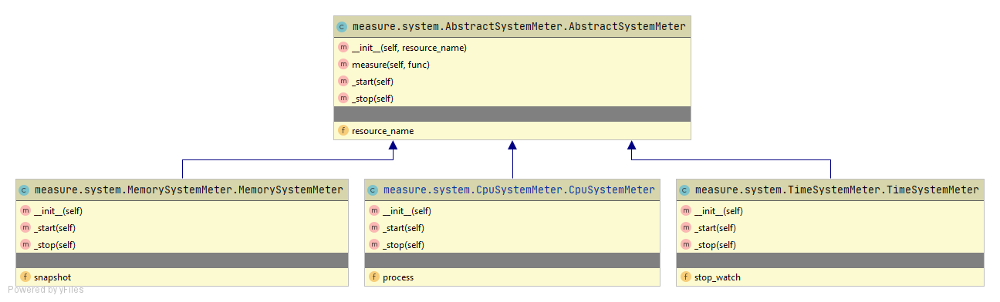

# Performance

**Inhaltsverzeichnis**
- [Übersicht](#Übersicht)
- [Bibliotheken](#Bibliotheken)
  - [Geschwindigkeit (time)](#Geschwindigkeit)
  - [Speicher (tracemalloc)](#Speicher)
  - [CPU (psutil)](#CPU)
- [Messungen](#Messungen)
  - [Aufbau](#Aufbau)
  - [Durchführung](#Durchführung)
- [Auswertungen](#Auswertungen)
  - [Response time](#Response-time)
  - [Memory peak](#Memory-peak)
  - [CPU usage](#CPU-usage)
  - [Fazit](#Fazit)

[Zurück zum Hauptmenu](../README.md)


## Übersicht
Für die Performance Messungen wurden die folgenden Bibliotheken verwendet: 
- Python `time` library für Messung der Geschwindigkeit.
- Python `tracemalloc` library für Messung des Speicherverbrauchs.
- Python `psutil` (Process and System utilities) library für die Messung der CPU Auslastung.

Eine interessante Alternative bietet auch die Python `resource` Bibliothek. Diese ist aber Unix/Linux spezifisch und kann 
nicht unter Windows verwendet werden. Diese Einschränkung existiert bei den verwendeten Bibliotheken nicht, diese sind unabhängig vom Betriebssystem verfügbar.  

Für die Messung der Modelle wurde ein einheitliche Schnittstelle eingeführt. Je Bibliothek wurden die Antwortzeit, der Speicherverbrauch
und die CPU Auslastung ermittelt. Anschliessend folgen die [Auswertungen](#Auswertungen) der Perfomance Daten.

Details zu den Modell Messungen in Bezug auf den Score siehe [Modelle](Modelle.md). 


## Bibliotheken

### Geschwindigkeit
Zur Messung der Geschwindigkeit wird eine Zeitfunktion benötigt. Im Kontext der Zeit kann dabei zwischen **absoluter** 
und **realiver Zeit** unterschieden werden.
- Die absolute Zeit wird von der `time.time()` Funktion zur Verfügung gestellt und wird aus der Differenz zu einem fixen
  Referenzwert (UNIX epoch of 00:00:00 UTC on 01/01/1970) gebildet. Die Genauigkeit ist mindestens eine Sekunde, bei 
  modernen Systemen normalerweise eine Milli- oder Microsekunde. 
- Die realtive Zeit wird von `time.clock()` respektive von den `time.perf_counter()` und `time.process_time()` 
  Funktionen zur Verfügung gestellt. Die relative Zeitmessung hat keinen Bezug zum fixen Referenzwert der absoluten Zeit 
  und kann daher nur für die Messung von Intervallen verwendet werden. Die bisherige `time.clock()` funktion ist 
  _Deprecated_ und wird ab Python Version 3.8 nicht mehr zur Verfügung gestellt.

Für die Messung der Dauer wird die Python `time.perf_counter()` Methode verwendet, welche seit der Version 3.3  in Python verfügbar 
ist. Für die Messung wird die Klasse [StopWatch.py](../measure/StopWatch.py) implementiert. Diese misst neben der Dauer auch den 
Start und Endzeitpunkt:
```python
class StopWatch:
    """Stop Watch to measure the elapsed time."""

    def __init__(self):
        self.start_time    = None
        self.start_counter = None
        self.stop_time     = None
        self.stop_counter  = None

    def start(self):
        self.start_time = self._now()
        self.start_counter = self._count()

    def stop(self):
        self.stop_time = self._now()
        self.stop_counter = self._count()

    def elapsed(self, precision=2):
        if (self.start_counter == None or self.stop_counter == None):
            return None
        diff = self.stop_counter - self.start_counter
        precision_format = '.' + str(precision) + 'f'
        return format(round(diff,precision), precision_format)

    def _now(self):
        return datetime.datetime.now();

    def _count(self):
        return time.perf_counter()
```

## Speicher
Der Python Interpreter bietet sogenannte `hooks` an, die es erlauben den laufenden Python Code zu analysieren. Neben
dem Debugger werden diese auch von der `tracemalloc` Library genutzt um Details zum Speicherverbrauch zu messen und 
auszugeben. 

Die `tracemalloc` Bibliothek ist seit Python Version 3.4 verfügbar und liefert sehr fein granulare Angaben zur **Memory
Allokation** des laufenden Python Prozesses. Mit Hilfe von zwei Snapshosts kann der aktuelle Memory Verbrauch, der Peak 
als auch Statistiken zum Speicherbedarf einzelner Befehle (per Dateiname oder Zeilennummer) gemessen werden, wie im 
folgenden Code Ausschnitt dargestellt:
```python
tracemalloc.start()

snapshot1 = tracemalloc.take_snapshot()
...Ausführung Code...
snapshot2 = tracemalloc.take_snapshot()

current, peak = tracemalloc.get_traced_memory()
print(f"Current memory usage is {current / 10**6}MB; Peak was {peak / 10**6}MB for model", model.library_name)

top_stats = snapshot2.compare_to(snapshot1, 'lineno')
print("[ Top 10 differences ]")
for stat in top_stats[:10]:
    print(stat)

tracemalloc.stop()
```

Beachte:
> Die Ausführung der `tracemalloc` Funktion ist sehr zeitintensiv. Daher sollten die Messungen zum Speicherverbrauch nicht
gelichzeitig mit den anderen Performance Messungen ausgeführt werden.


## CPU 
Die `psutil` Library ist eine Cross-Plattform Bibliothek für Prozess und System Monitoring Aufgaben. Die Messung der CPU 
Auslastung kann mit dem Aufruf der `cpu_percent` Methode vor und nach dem zu messendem Code Block durchgeführt werden:  
```python
# init cpu_percent, result is meaningless unless next call
res = p.cpu_percent(interval=None)
...Ausführung Code...


# Note cpu_percent:
# the returned value can be > 100.0 in case of a process running multiple threads on different CPU cores.
res = p.cpu_percent(interval=None)
print(res / psutil.cpu_count() )
```

Beachte:
> Die berechnete CPU Auslastung kann über 100% liegen, falls ein Prozess mehrere Threads auf verschiedenen CPU Cores 
ausführt. Daher wird der Wert durch die Anzahl CPU's dividiert.


## Messungen

### Aufbau

#### AbstractSystemMeter

Für die Perfomance Messungen wird die Basisklasse [AbstractSystemMeter.py](../measure/system/AbstractSystemMeter.py) zur Verfügung 
gestellt. Diese bildet eine gemeinsame Schnittstelle für die einzelnen Performance  Messungen:
```python
class AbstractSystemMeter:
    """Common system meter interface for all resource monitorings.

    For each system resource to monitor, a wrapper class will be written as subclass of this one. This way we have
    a common "interface" for all system resources to test.

    This approach is choosen since python has no real interfaces like Java or C-Sharp.
    """

    def __init__(self, resource_name):
        self.resource_name = resource_name


    def measure(self, func):
        self._start()
        func()
        return self._stop()


    def _start(self):
        raise NotImplementedError("The method is not implemented yet.")


    def _stop(self):
        raise NotImplementedError("The method is not implemented yet.")
```

#### System Meter Hierarchie
Für jede Performance Messung wird eine entsprechende Unterklasse implementiert:
- [CpuSystemMeter.py](../measure/system/CpuSystemMeter.py)
- [MemorySystemMeter.py](../measure/system/MemorySystemMeter.py)
- [TimeSystemMeter.py](../measure/system/TimeSystemMeter.py)

Damit ergibt sich folgenden Klassen Hierarchie:



### Durchführung

#### Testdaten
Als [Testdaten](Testdaten.md) werden die Texte mit den gemischten Sprachen eingesetzt. Die für die Messungen eingesetzten 
Sets sind im Report Scripts ersichtlich.

#### Reports und Resultate
Die Performance Messungen werden mit dem [ReportSystemPerformance.py](../reports/ReportSystemPerformance.py) Skript ausgeführt. 
Das Skript kann direkt von der integrierten Entwicklungsumgebung (z.B. IntelliJ) oder via Shell aufgerufen werden.

Die Kennzahlen `Time`, `CPU` und `Memory Peak` für alle Modelle nacheinander gemessen. **Jede Kennzahl wird einzeln je 
Modell ermittelt**. Damit können Seiteneffekte ausgeschlossen werden. Die Messungen werden auf einem Laptop durchgeführt. 

Die Hardware ist natürlich ein entscheidender Faktor für die absoluten Messwerte. Für den Vergleich ist das aber nicht 
von Bedeutung, da die Bibliotheken **untereinander verglichen** werden sollen. Einzige Bedingung ist, dass die Messungen 
auf dem gleichen Gerät ausgeführt werden. 

Mit den erwähnten Test Skript  ist das gegeben. Als Resultat wird ein **Data Frame** mit allen Modellen und deren 
Messdaten ausgegeben. Zusätzlich werden die Resultate als **CSV Datei** gespeichert.

Report                                                           | Resultat                                              | Beschreibung
---------------------------------------------------------------- | ----------------------------------------------------- | --------------------------------------------------------------  
[ReportSystemPerformance](../reports/ReportSystemPerformance.py) | [CSV](../reports/outcome/ReportSystemPerformance.csv) | Auswertung von Response Time, CPU Auslaustung und Memory Peak je Modell für gemischte Texte.


## Auswertungen
Mit dem Jupiter Notebook [Visualization.ipynb](../reports/Visualization.ipynb) werden die einzelnen Report Resultate  grafisch 
ausgewertet und die Bilder zusätzlich (als PNG Datei) im Projekt abgelegt. 

Die Performance Messungen werden nacheinander für alle Modelle und jede Kennzahl einzeln ausgeführt. Als Testdaten werden die 
1'000 gemischte Artikeltexte in den Sprachen Deutsch, Französisch, Italienisch und Englisch verwendet. 

### Response time
Die Auswertung zeigt die durchschnittliche Antwortzeit pro Aufruf:


#### Interpretation
- Der Azure Text Analytics Service wird über das Internet via REST Call aufgerufen und ist daher erwartungsgemäss am langsamsten.
- Die anderen Bibliotheken werden innerhalb vom Projekt aufgerufen und sind daher schneller. Trotzdem gibt es auch da grosse 
Unterschiede.
- Die LangFromChars Bibliothek  ist mit über 60 ms pro Aufruf sehr langsam, gefolgt von LangDetectSpacy mit rund 12 ms.
- **Schnell** ist die **LangDetect** Bibilothek mit rund 4 ms.
- Am **absolut schnellsten** ist die **LangFromStopwords** Bibliothek mit einer durchschnittliche Antwortweit von 0.1 ms. Das liegt
vor allem am Architekturansatz mit den Wortlisten gegenüber den Machine Learning Verfahren der anderen Bibliotheken.


### Memory peak 
Die Auswertung zeigt den maximalen Memory Bedarf der Modelle während der Prognose von 1'000 Artikeltexten:


#### Interpretation
- Mit über **280 MB** weist die **LangFromChars** Bibliothek **mit Abstand den grössten Speicherbedarf** auf.
- Die **anderen Bibliotheken** liegen mit 1.3 MB für LangDetectSpacy und rund 0.5 MB für die restlichen Bibliotheken 
**deutlich darunter**.
- Der vom Azure Text Analytics  Service benötige Speicherbedarf ist vor allem für den REST Aufruf und liegt leicht
über dem Bereich der LangDetect und LangFromStopwords Bibliotheken.
   


### CPU usage
Die Auswertung zeigt die CPU Auslastung der verschiedenen Modelle während der Prognose von 1'000 Artikeltexten:


#### Interpretation
- Hier liegt der **Azure Text Analyitics** Service im **Vorteil**, da die **Rechenleistung remote** durch den Service 
geleistet wird. Im Projekt wird nur der REST Call ausgeführt.
- Die CPU Auslastung der **LangFromChars** Bibliothek ist mit **über 17 MB** mehr als **doppelt so hoch** wie bei den 
  **restlichen Bibliotheken**, welche rund 8% CPU Auslastung aufgewiesen. 


### Fazit
Wenn man alle drei Performance Auswertungen betrachtet, muss man **unterscheiden** zwischen dem Azure Text Analytics 
Service und den anderen Bibliotheken. 

Azure Text Analytics Service:
- Der Azure Service läuft **remote**, das heisst **CPU** Auslastung und **Memory Peak** sind **gering**, dafür hat man 
  eine **langsame Antwortzeit**. 
- Die Messung der Antwortzeit erfolgte dabei je Aufruf. Azure bietet aber auch an, das mehrere Texte gleichzeitig 
  (mit einem Call) bearbeitet werden.
- Je nach Anwendungsscenario kann hier also die durchschnittliche **Antwortzeit**, mit Hilfe von **Batch Aufrufen**, 
  stark **verbessern**.

Bibliotheken:
- Hier fällt vor allem die **LangFromChars** Bibliothek mit **schlechten Werten** auf. Der CPU Verbrauch ist doppelt so 
  hoch und der Memory Peak fällt mehr als 250 mal höher aus.
- Die LangDetectSpacy Bibliothek ist etwas langsamer und benötigt mehr Speicher als die beiden anderen.
- Absoluten **Spitzenreiter** ist die **LangFromStopwords** Bibliothek, was auf die komplett **einfache Architektur** 
  zurückzuführen ist.

Den Perfomance Resultaten gegen über stehen natürlich die **Modell Messungen**, welche für die Auswahl der Bibliotheken
**ebenso entscheidend** sind. Details hierzu siehe [Modelle](Modelle.md). 

---
[Zum Seitenanfang](#Performance)  &nbsp; | &nbsp;  [Zum Hauptmenu](../README.md)
