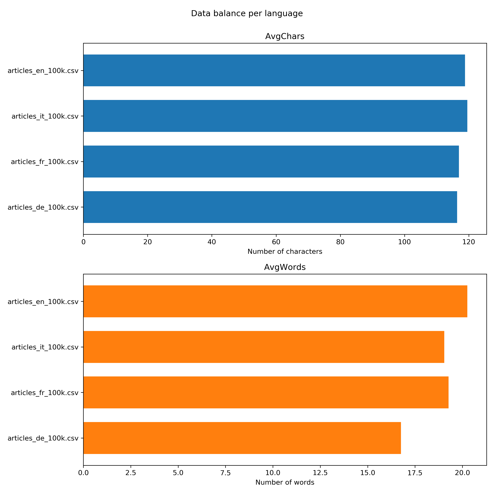

# Testdaten

**Inhaltsverzeichnis**
- [Übersicht](#Übersicht)
- [Download und Extraktion](#Download-und-Extraktion)
  - [Download DUMP Dateien](#Download-DUMP-Dateien)
  - [Extraktion Wiki Artikel](#Extraktion-Wiki-Artikel)
- [Analyse der Daten](#Analyse-der-Daten)
  - [Beispiele Wiki Artikel](#Beispiele-Wiki-Artikel)
  - [Struktur](#Struktur)
- [Aufbereitung der Daten](#Aufbereitung-der-Daten)
  - [Transformationsregeln](#Transformationsregeln)
  - [CSV Format](#CSV-Format)
  - [WikiTransformer](#WikiTransformer)
- [Testdaten Sets und Balance](#Testdaten-Sets-und-Balance)
  - [Testdaten Sets](#Testdaten-Sets)
  - [Testdaten Balance](#Testdaten-Balance)

[Zurück zum Hauptmenu](../README.md)


## Übersicht
Als Testdaten werden Artikel von Wikipedia verwendet. 
- Diese können als sogenannte `DUMP` Dateien für eine gewünschte Sprache bezogen werden. 
- Für die Spracherkennungstests werden die Artikeltexte bereinigt und ins `CSV` Format transformiert. 

Für die Analyse und Aufbereitung der Testdaten werden folgende Schritte ausgeführt:
1. Download DUMP Dateien und Extraktion der Wiki Artikel.
2. Analyse der Artikel Struktur für die weitere Verarbeitung.
3. Definition der Transformationsregeln und des gewünschten Ausgabeformat in CSV.
   Erstellung Klasse für die Transformation und CSV Erstellung.
4. Analyse der Testdaten auf Ausgeglichenheit. 

Die einzelenen Verarbeitungsschritte werden nachfolgend im Detail erläutert. 

## Download und Extraktion
  
### Download DUMP Dateien
Download der Wiki `DUMP` Dateien mit dem Script `data/download.sh` oder direkt mit dem Browser via die folgenden URL's:
- https://dumps.wikimedia.org/enwiki/latest/enwiki-latest-pages-articles.xml.bz2
- https://dumps.wikimedia.org/dewiki/latest/dewiki-latest-pages-articles.xml.bz2
- https://dumps.wikimedia.org/frwiki/latest/frwiki-latest-pages-articles.xml.bz2
- https://dumps.wikimedia.org/itwiki/latest/itwiki-latest-pages-articles.xml.bz2
 
Die Dateien sind zwischen 3GB und 17GB gross und werden nicht als Teil des Projektes ins GIT Repository eingecheckt. 
Bei Bedarf können Sie jederzeit wieder bezogen werden.
 
### Extraktion Wiki Artikel
Für die Weiterverarbeitung werden die Daten aus den `DUMP` Dateien extrahiert und in Textdateien zu 100MB Grösse 
abgelegt. 
- Hierzu wird der [WikiExtraktor](../data/WikiExtractor.py) von Giuseppe Attardi verwendet.  
  Details zur Verwendung sind im [GitHub Repository von Giuseppe Attardi](https://github.com/attardi/wikiextractor) ersichtlich.
- Die Extraktion der Daten erfolgt mit dem Script [extract.sh](../data/extract.sh).
  Alternativ können die Befehle aus dem Script direkt in der Anaconda Shell ausgeführt werden. 
- Pro Sprache (de, fr, it, en) werden die ersten 12 Dateien im Verzeichnis [extract](../data/extract) gespeichert. 
  Die Artikeldateien werden als Bestandteil vom Projekt ins Git Repository eingecheckt. 
   
## Analyse der Daten 

### Beispiele Wiki Artikel
Die beiden folgenden Beispiele zeigen exemplarisch den Aufbau der Wiki Artikel nach der Extraktion der Daten: 

Artikel:
```xml
<doc id="1" url="https://de.wikipedia.org/wiki?curid=1" title="Alan Smithee">
Alan Smithee

Alan Smithee steht als Pseudonym für einen fiktiven Regisseur, der Filme verantwortet, bei denen der eigentliche Regisseur seinen Namen nicht mit dem Werk in Verbindung gebracht haben möchte. Von 1968 bis 2000 wurde es von der Directors Guild of America (DGA) für solche Situationen empfohlen, seither ist es Thomas Lee. "Alan Smithee" ist jedoch weiterhin in Gebrauch.

Alternative Schreibweisen sind unter anderem die Ursprungsvariante "Allen Smithee" sowie "Alan Smythee" und "Adam Smithee". Auch zwei teilweise asiatisch anmutende Schreibweisen "Alan Smi Thee" und "Sumishii Aran" gehören – so die Internet Movie Database – dazu.

Das Pseudonym entstand 1968 infolge der Arbeiten am Western-Film "Death of a Gunfighter" (deutscher Titel "Frank Patch – Deine Stunden sind gezählt"). Regisseur Robert Totten und Hauptdarsteller Richard Widmark gerieten in einen Streit, woraufhin Don Siegel als neuer Regisseur eingesetzt wurde.

... usw ...

Auch in Computerspielen wird dieses Pseudonym angegeben: Im Abspann des Ego-Shooters "Marine Sharpshooter IV" aus dem Jahr 2008 wird als Art Director des Spiels "Alan Smithee" genannt.

2014 produzierte die New Yorker Performance-Kompanie Big Dance Theater "Alan Smithee Directed this Play", das im August des Jahres auch in Berlin bei Tanz im August aufgeführt wurde.

</doc>
```

Liste von Autoren:
```xml
<doc id="13" url="https://de.wikipedia.org/wiki?curid=13" title="Liste von Autoren/A">
Liste von Autoren/A


</doc>
```

### Struktur 

Die Struktur der Wiki Artikel ist wie folgt:
- Jeder Artikel ist innerhalb eines `<doc>` Tag. 
- Die Textdatei selber ist aber kein gültiges XML Format da es zum Beispiel kein Wurzelelement (Root Tag) gibt.
- Das Start Tag (Zeile 1) beinhaltet Attribute mit der URL auf den Artikel und dem Titel des Artikels.
- Der Title (Zeile 2) ist auch Bestandteil des Artikel Texts.
- Die einzelnen Abschnitte sind mit Zeilenumbrüchen und Leerzeilen getrennt voneinander.

Die Struktur von Wiki Autoren Einträgen:
- Der Aufbau ist gleich wie bei den Artikeln.
- Neben dem Titel gibt es aber keine weiteren Informationen.
- Diese Artikel Einträge sind daher für unsere Zwecke nicht geeignet.


## Aufbereitung der Daten

### Transformationsregeln
Die extrahierten Daten sind im Verzeichnis [extract](../data/extract) je Sprachcode abgelegt und werden als nächstes wie folgt 
bereinigt / transformiert:
1. Artikel welche nur minimale Texte aufweisen (wie zum Beispiel die Autoren Einträge) werden nicht verwendet. 
   Das heisst alle Artikel die weniger als 10 Zeilen (inkl. Leerzeilen) aufweisen werden herausgefiltert/ignoriert.
2. Die Zeilen mit Start- und Endtag (`<doc>`, `</doc>`) selber werden ebenfalls gefiltert. 
3. Leerzeilen werden eliminiert.
4. Mehrfache Leerzeichen werden mit einem Leerzeichen ersetzt. 
5. Leerzeichen am Anfang und Ende einer Linie sowie alle Zeilenumbrüche werden aus dem Artikel Text eliminiert.
6. Die Attribute `id`, `title` und `url` aus dem `<doc>` Tag gelesen und als Bestandteil der CSV Datei gespeichert.
7. Der Sprachcode `lang` ergibt sich aus dem Verzeichnis Namen der extrahierten Daten 
8. Der Artikel Inhalt `content` wird auf 120 Zeichen begrenzet. 
   Die Limite soll bei der Erstellung der Testdaten Sets angegeben werden können.
9. Artikel mit leerem Inhalt führen bei den Tests zu NaN Fehlern und weden daher herausgefiltert. 

Bemerkung zu Regel Nr. 9:
- Das Problem der Artikel mit leerem Inhalt trat erst bei den Tests mit grossen Datenmengen auf. 
- Um den Fehler zu reporduzieren wurde der Unit Test [WikiTransformerNaNTest.py](../tests/WikiTransformerNaNTest.py)  erstellt
  und via Debug Session analyisert. 
- Anschliessend wurde die neue Transformationsregel Nr. 9 in der [WikiTransformer.py](../data/WikiTransformer.py) Klasse implementiert, 
  bis der Unit Test erfolgreich ausgeführt werden konnte.


### CSV Format
Für die Tests werden die Daten im CSV Format bereitgesellt. Die CSV Dateien sind mit Unicode (UTF-8) codiert 
und weisen folgendes Format auf: 

Feld         | Inhalt
------------ | ------------------------------------------------
id           | Id des CSV Dump File (eindeutig pro Sprachcode)
lang         | Sprachcode ['de', 'en', 'fr', 'it'] gemäss ISO 639-1 
url          | URL auf den entsprechenden Wiki Artikel
title        | Titel des Artikel
content      | Inhalt des Artikel (Artikel Text)

Für die Tests werden die Spalten **lang** und **content** verwedent. Die anderen Daten sind einzig zu Informationszwecken aufgeführt. 


### WikiTransformer
Für die Transformation der Daten wird die Klasse [WikiTransformer.py](../data/WikiTransformer.py) bereitgestellt. Die wichtigsten Methoden sind:
- **read_file** zum Lesen der extrahierten Dump Dateien.
- **transform** zum Transformieren der einzelnen Artikel Daten gemäss den Transformationsregeln.
- **write_csv** zum Speichern der Artikel Daten als CSV Datei.

Mit weiteren Hilfsmethoden und Einstellungen können flexibel Daten transformiert und in belibiger Menge gespeichert werden. 
Einen guten Einblick in den Funktionsweise der Klasse zeigt auch der dazugehörige Unit Test [WitkTransformerTest.py](../tests/WikiTransformerTest.py). 

WikiTransformer:
```python
import sys
import csv
from pathlib import Path

class WikiTransformer():
    """Transform and prepare Wiki data."""

    def __init__(self, min_doc_lines=10, max_content_size=120, max_articles=1000):
        self.min_doc_lines = min_doc_lines          # Skip articles with less than 10 lines of raw content (inkl. tags, header, emtpy lines)
        self.max_content_size = max_content_size    # Maximal size of the cleand and prepared article content
        self.max_articles = max_articles            # Maximal number of articles
        self.articles = []


    def read_file(self, path, file, encoding="utf-8"):
        path = Path(path)
        pf = path/file
        with open(pf, "r", encoding=encoding) as f:
            content = f.read()
        return content


    def transform(self, lang, docs, append=True):
        if (append == False):
            self.articles = []

        for doc in docs.split("</doc>"):
            raw_lines = doc.split("\n")

            # skip articles with less than min doc lines
            if (len(raw_lines) < self.min_doc_lines):
                continue

            # extract article
            content = ""
            first = True
            for raw_line in raw_lines:

                # remove leading and trailing blanks and skip empty lines
                line = raw_line.strip()
                if (len(line) == 0):
                    continue

                # parse doc attributes
                if ( line.startswith("<doc") ):
                    article_id = self._extraxt_attr(line, "id")
                    title = self._extraxt_attr(line, "title")
                    url = self._extraxt_attr(line, "url")
                    continue

                # skip title line
                if (line == title):
                    continue

                # clean content
                line = self._clean_content(line)

                # add content until MAX_SIZE is reached
                if (len(content) >= self.max_content_size):
                    break

                if first:
                    content = line
                    first = False
                else:
                    content = content + ' ' + line

            # create article and add to list
            if (len(content) != 0):
                article = {"id":article_id, "lang":lang, "url":url, "title":title, "content":content[:self.max_content_size]}
                self.articles.append(article)

            # check maximal article count
            if (len(self.articles) >= self.max_articles):
                break

        # return result
        return self.articles


    def write_csv(self, path, file, encoding="utf-8"):
        csv_columns = ["id", "lang", "url", "title", "content"]
        csv_file = Path(path)/file
        article = {}
        try:
            with open(csv_file, 'w', encoding=encoding, newline='') as csvfile:
                writer = csv.DictWriter(csvfile, fieldnames=csv_columns)
                writer.writeheader()
                for article in self.articles:
                    writer.writerow(article)
        except: # catch all
            e = sys.exc_info()[0]
            print("Error  : {0}".format(e))
            print("Article: {0}".format(article) )


    def max_articles_reached(self):
        return (len(self.articles) >= self.max_articles)

    def _extraxt_attr(self, doc, attr):
        """Extract an attribute value from the text document.

        Sample:
        doc = '<doc id="1" url="https://de.wikipedia.org/wiki?curid=1" title="Alan Smithee">"'
        id_value =  extract_attr(doc, 'id')
        title_value = extract_attr(doc, 'title')
        """
        start = doc.index(attr) + len(attr) + 2
        end = doc.index('"', start)
        return doc[start:end]


    def _clean_content(self, line):
        # eliminate double quotes
        result = line.replace('"', '')
        # replace multi spaces with one (without a regex)
        result = ' '.join(result.split())[0:]
        # return cleaned content
        return result
```

## Testdaten Sets und Balance

### Testdaten Sets
Mit den beiden Python Scripts [transform.py](../data/transform.py) und [transform_mixed.py](../data/transform_mixed.py) werden im 
Verzeichnis [data](../data/transform) folgende Testdaten Sets bereitgestellt:

Sprache  | 1'000 Texte | 5'000 Texte | 10'000 Texte | 100'000 Texte
-------- | ----------- | ----------- | ------------ | -------------
Gemischt | [articles_all_1k.csv](../data/transform/articles_all_1k.csv) | [articles_all_5k.csv](../data/transform/articles_all_5k.csv) | [articles_all_10k.csv](../data/transform/articles_all_10k.csv) | [articles_all_100k.csv](../data/transform/articles_all_100k.csv) 
Deutsch  | [articles_de_1k.csv](../data/transform/articles_de_1k.csv)   | [articles_de_5k.csv](../data/transform/articles_de_5k.csv)   | [articles_de_10k.csv](../data/transform/articles_de_10k.csv)   | [articles_de_100k.csv](../data/transform/articles_de_100k.csv) 
Französisch | [articles_fr_1k.csv](../data/transform/articles_fr_1k.csv)| [articles_fr_5k.csv](../data/transform/articles_fr_5k.csv)   | [articles_fr_10k.csv](../data/transform/articles_fr_10k.csv)   | [articles_fr_100k.csv](../data/transform/articles_fr_100k.csv) 
Italienisch | [articles_it_1k.csv](../data/transform/articles_it_1k.csv)| [articles_it_5k.csv](../data/transform/articles_it_5k.csv)   | [articles_it_10k.csv](../data/transform/articles_it_10k.csv)   | [articles_it_100k.csv](../data/transform/articles_it_100k.csv) 
Englisch    | [articles_en_1k.csv](../data/transform/articles_en_1k.csv)| [articles_en_5k.csv](../data/transform/articles_en_5k.csv)   | [articles_en_10k.csv](../data/transform/articles_en_10k.csv)   | [articles_en_100k.csv](../data/transform/articles_en_100k.csv) 

Der Bezeichnungen **[1k, 5k, 10k und 100k]** steht für die  Anzahl Einträge je Datei. Aktuell werden also CSV Dateien 
mit 1'000, 5'000, 10'000 und 100'000 Texten in den Sprachen Deutsch, English, Französisch und Italienisch bereitgestellt. 
Zusätzlich gibt es für jede der genannten Grössen eine Datei mit gemischten Texten.

> Durch Anpassung der Parameter in den beiden Scripts können jederzeit weitere Testdaten Sets in beliebigen Grössen und 
Sprachkombinationen erstellt werden.  

### Testdaten Balance
Die Modelle sollen auch in Bezug auf die einzelnen Sprachen untersucht werden. Dazu ist es wichtig, dass die Testdaten
ausgeglichen sind und nicht eine Asymetrie zwischen verschiedenen Sprachen besteht.

- Mit der Python Klasse [ReportDataBalance.py](../reports/ReportDataBalance.py) werden die CSV Daten eingelesen und die 
durchschnittliche Anzahl Zeichen sowie die durchschnittliche Anzahl Wörter pro Sprache ermittelt. 
- Die Resultate sind in der  [CSV Datei](../reports/outcome/ReportDataBalance.csv) ersichtlich. 
- Die grafische Auswertung erfolgt mit dem Jupiter Notebook [Visualization.ipynb](../reports/Visualization.ipynb).

**Auswertung**


- Die durchschnittliche Anzahl Zeichen ist knapp unter 120. Ursache ist die Begrenzung
  **max_content_size=120** des WikiTransformer, welcher die Artikel Länge auf max. 120 Zeichen begrenzt. 
- Die durchschnittliche Anzahl Wörter schwankt etwas mehr, was aber mit der Charakteristik der 
  Sprache zusammenhängt. Auch hier sind die Daten ausgeglichen.

> Es zeigt sich, dass die Daten in Bezug auf die Anzahl Zeichen und Wörter ausgeglichen sind. 
> Ein Vergleich der Modelle in Bezug auf Performance je Sprache ist mit den vorliegenden Testdaten somit gut möglich.

---
[Zum Seitenanfang](#Testdaten)  &nbsp; | &nbsp;  [Zum Hauptmenu](../README.md)

